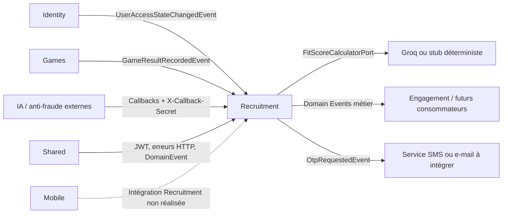

# Module Recruitment

**Dernière mise à jour :** 2026-07-16

## 1. Rôle du module

Le bounded context `recruitment` couvre le parcours de recrutement après la création
du compte dans Identity : publication d'offres, découverte par swipe, création des
matchs, évaluations techniques, candidatures, offres d'opportunité, vérifications
d'identité et paiement d'une visioconférence.

Le contrat public de référence est `contracts/recruitment.openapi.yaml`. Il décrit
exactement les 43 opérations réellement exposées sous `/api/v1`.

Le module ne gère pas :

- les comptes, mots de passe, JWT ou profils personnels, qui appartiennent à Identity ;
- la livraison SMS/e-mail des OTP, qui reste à brancher ;
- les conversations et appels vidéo, qui relèvent d'Engagement ;
- les écrans mobiles Recruitment, bloqués tant que les 13 maquettes citées par le
  plan ne sont pas présentes dans le dépôt ;
- le paiement bancaire réel, car le PSP reste à intégrer.

## 2. Architecture technique

| Couche | Emplacement | Responsabilité |
|---|---|---|
| API | `recruitment/api/` | Contrôleurs REST, DTO et annotations de sécurité locales |
| Application | `recruitment/application/` | Cas d'usage, contrôles de propriété, OTP et listeners d'événements |
| Domaine | `recruitment/domain/` | Agrégats, règles métier, événements, value objects et ports |
| Infrastructure | `recruitment/infrastructure/` | JPA, PostgreSQL, callbacks et données de développement |
| Contrat | `contracts/recruitment.openapi.yaml` | Source de vérité de l'API publique |

Le domaine reste en Java pur. Les dépendances vont de l'extérieur vers le domaine.
Recruitment ne doit jamais appeler directement les services ou repositories internes
d'un autre bounded context.

## 3. Relations avec les autres modules



### 3.1 Identity → Recruitment

Identity publie `identity.user.access-state-changed.v1` après inscription,
authentification, changement de rôle, désactivation et suppression. L'événement ne
contient que l'UUID public, le rôle et l'état actif ; aucune PII n'est copiée.

Recruitment maintient la projection locale `recruitment.actors`. Elle permet de
vérifier qu'un JWT encore valide appartient toujours à un utilisateur actif et possède
toujours le rôle attendu. Un snapshot Identity au démarrage initialise les comptes
existants. Les événements rejoués ou plus anciens sont ignorés.

### 3.2 Shared → Recruitment

Shared fournit le filtre JWT, la conversion des rôles, les erreurs HTTP communes et
l'interface `DomainEvent`. Il ne contient aucune règle métier Recruitment.

### 3.3 Recruitment → Engagement et livraison OTP

Recruitment publie ses événements métier sans appeler directement Engagement. Les
événements d'opportunité et de paiement pourront débloquer une carte de conversation
ou un appel vidéo chez un consommateur externe.

`recruitment.otp.requested.v1` contient temporairement le code et le `recipientUserId`.
Le code est destiné à un futur listener SMS/e-mail. Aucun consommateur de livraison
n'est actuellement présent : la génération et la vérification fonctionnent côté
backend, mais l'utilisateur ne reçoit pas encore automatiquement le code.

### 3.4 Games → Recruitment et moteur de fit score

`GameResultRecordedEvent` alimente la projection locale `soft_skills_projection`.
Recruitment recalcule ensuite, par lots bornés, les couples candidat/offre active.
Le calcul passe par `FitScoreCalculatorPort` : Groq est utilisé si `GROQ_API_KEY`
est configurée, sinon un calculateur déterministe permet le fonctionnement offline.

L'entrée CV reste explicitement `PROVISOIRE` et vide tant qu'Identity ne publie pas
un événement de profil. Aucun appel direct vers Identity n'a été ajouté.

### 3.5 Fournisseurs externes → Recruitment

Les services IA et anti-fraude publient leurs résultats sur les trois callbacks. Ils
n'utilisent pas de JWT utilisateur mais doivent fournir `X-Callback-Secret`.

## 4. Authentification et autorisation

La surface contractuelle de 43 opérations se répartit ainsi :

- 37 opérations privées avec JWT ;
- 3 opérations déclarées publiques ;
- 3 callbacks protégés par secret partagé.

La résolution publique `GET /tests/{token}` reste bloquée par le filtre global et
retourne `401` tant que l'ajout ciblé dans `shared/SecurityConfig` n'est pas autorisé.
Le contrôleur, le contrat et la projection sans réponses correctes sont prêts.

Les annotations locales sont :

- `RecruiterOnly` : JWT recruteur et acteur toujours actif ;
- `CandidateOrStudentOnly` : JWT candidat ou étudiant et acteur actif ;
- `Authenticated` : JWT valide, acteur actif, puis contrôle de propriété dans le cas d'usage ;
- `PreAuthorize` conditionnel pour le swipe candidat ou recruteur.

L'identité agissante vient toujours du `sub` du JWT. Les requêtes ne peuvent pas
choisir leur `recruiterId`, `candidateId` ou `swiperId`. Les identifiants de cible
restent autorisés lorsqu'ils représentent réellement l'objet métier visé.

## 5. Inventaire complet des endpoints

Légende : `JWT R` = recruteur, `JWT C/S` = candidat ou étudiant, `JWT Auth` = tout
acteur authentifié avec contrôle de propriété, `Secret` = `X-Callback-Secret`.

### 5.1 Offres d'emploi — 7 opérations

| Méthode | Route | Accès | Comportement et propriété |
|---|---|---|---|
| GET | `/job-offers` | Public | Recherche paginée des offres `ACTIVE` uniquement |
| POST | `/job-offers` | JWT R | Crée une offre pour le recruteur du JWT |
| GET | `/recruiters/me/job-offers` | JWT R | Liste uniquement les offres du recruteur connecté |
| GET | `/job-offers/{jobOfferId}` | Public | Retourne le détail uniquement si l'offre est `ACTIVE` |
| PATCH | `/job-offers/{jobOfferId}` | JWT R | Modifie uniquement une offre appartenant au recruteur |
| DELETE | `/job-offers/{jobOfferId}` | JWT R | Supprime une offre autorisée du recruteur propriétaire |
| PATCH | `/job-offers/{jobOfferId}/status` | JWT R | Applique une transition de statut valide sur une offre possédée |

### 5.2 Swipes et matchs — 5 opérations

| Méthode | Route | Accès | Comportement et propriété |
|---|---|---|---|
| POST | `/swipes` | JWT C/S ou R | Le candidat swipe une offre ; le recruteur swipe un candidat pour sa propre offre |
| DELETE | `/swipes/{swipeId}` | JWT Auth | Annule uniquement le swipe de l'acteur connecté et nettoie le match associé |
| GET | `/swipes/targets` | JWT Auth | Retourne les cibles déjà swipées par l'acteur du JWT |
| GET | `/candidates/me/matches` | JWT C/S | Liste les matchs du candidat connecté |
| GET | `/recruiters/me/matches` | JWT R | Liste les matchs du recruteur, avec filtre optionnel par offre |

Un match est créé uniquement après deux `LIKE` opposés portant sur la même paire
`candidateId + jobOfferId`.

### 5.3 Scores de compatibilité et decks — 3 opérations

| Méthode | Route | Accès | Comportement et propriété |
|---|---|---|---|
| GET | `/fit-scores` | JWT Auth | Le candidat lit son score ; le recruteur doit posséder l'offre concernée |
| DELETE | `/fit-scores?candidateId=&jobOfferId=` | JWT R | Masque idempotemment la paire pour le recruteur propriétaire |
| GET | `/recruiters/me/candidate-feed?jobOfferId=` | JWT R | Candidats projetés triés par score décroissant, hors paires masquées |

Le feed candidat est `GET /job-offers` : avec un JWT candidat et sans filtre de
recherche, les offres actives sont triées par fit score décroissant. Sans JWT, le
tri public reste chronologique. Le feed recruteur contient actuellement
`candidateId`, `fitScore` et `softSkillsScore`; les données personnelles attendent
la projection profil Identity.

### 5.4 Évaluations — 7 opérations

| Méthode | Route | Accès | Comportement et propriété |
|---|---|---|---|
| GET | `/assessments` | JWT R | Liste les évaluations du recruteur connecté |
| POST | `/assessments` | JWT R | Crée une évaluation et ses questions pour le recruteur |
| GET | `/assessments/mine` | JWT R | Alias historique de la liste des évaluations personnelles |
| GET | `/assessments/{assessmentId}` | JWT R | Retourne une évaluation appartenant au recruteur |
| PUT | `/assessments/{assessmentId}` | JWT R | Modifie une évaluation possédée |
| DELETE | `/assessments/{assessmentId}` | JWT R | Supprime une évaluation non référencée par une offre |
| GET | `/tests/{token}` | Public prévu | Projection candidat sans réponse correcte ; permit-list Shared encore requise |

Les réponses correctes restent réservées au recruteur. La projection publique
candidat ne contient jamais `correctOptionIndex`.

### 5.5 Tentatives d'évaluation — 3 opérations

| Méthode | Route | Accès | Comportement et propriété |
|---|---|---|---|
| POST | `/assessment-attempts` | JWT C/S | Soumet une tentative pour le candidat du JWT et calcule le score côté serveur |
| GET | `/assessment-attempts` | JWT R | Liste les résultats d'une offre appartenant au recruteur |
| GET | `/assessment-attempts/{attemptId}` | JWT Auth | Lecture par le candidat concerné ou le recruteur propriétaire de l'offre |

Une seule tentative est autorisée par candidat, évaluation et offre. L'évaluation doit
être assignée à l'offre, `consent=true` est obligatoire et la réponse contient
`applicationId`. Le seuil vient de l'offre (60 par défaut, valeur autorisée 0–100).

### 5.6 Candidatures — 5 opérations

| Méthode | Route | Accès | Comportement et propriété |
|---|---|---|---|
| GET | `/candidates/me/applications` | JWT C/S | Liste uniquement les candidatures du candidat connecté |
| POST | `/applications` | JWT C/S | Compatibilité historique dépréciée ; le nouveau tunnel passe par l'assessment |
| GET | `/applications/{applicationId}` | JWT Auth | Lecture par le candidat ou le recruteur propriétaire de l'offre |
| PATCH | `/applications/{applicationId}/status` | JWT R | Change le statut si le recruteur possède l'offre |
| GET | `/job-offers/{jobOfferId}/applications` | JWT R | Liste enrichie du meilleur attempt, applicantCount et successRate |

### 5.7 Offres d'opportunité — 5 opérations

| Méthode | Route | Accès | Comportement et propriété |
|---|---|---|---|
| POST | `/job-opportunity-offers` | JWT R | Envoie une opportunité depuis une offre possédée |
| GET | `/job-opportunity-offers/{offerId}` | JWT Auth | Lecture réservée au recruteur émetteur ou au candidat destinataire |
| POST | `/job-opportunity-offers/{offerId}/confirm` | JWT C/S | Le candidat destinataire demande la confirmation et l'OTP |
| POST | `/job-opportunity-offers/{offerId}/verify-otp` | JWT C/S | Vérifie l'OTP à usage unique et confirme l'opportunité |
| POST | `/job-opportunity-offers/{offerId}/reject` | JWT C/S | Rejette l'opportunité pour le candidat destinataire |

### 5.8 Vérification d'identité — 2 opérations

| Méthode | Route | Accès | Comportement et propriété |
|---|---|---|---|
| POST | `/identity-verifications` | JWT R | Demande une vérification pour une offre appartenant au recruteur |
| GET | `/identity-verifications/{verificationId}` | JWT Auth | Lecture par le recruteur demandeur ou le candidat concerné |

### 5.9 Paiement de visioconférence — 3 opérations

| Méthode | Route | Accès | Comportement et propriété |
|---|---|---|---|
| POST | `/payments` | JWT R | Initie un paiement pour un match appartenant au recruteur et génère un OTP |
| GET | `/payments/{paymentId}` | JWT R | Retourne uniquement un paiement du recruteur connecté |
| POST | `/payments/{paymentId}/verify-otp` | JWT R | Vérifie l'OTP et confirme le paiement possédé |

Le paiement actuel conserve seulement `last4` et le type de carte. Aucun numéro complet
n'est persisté et aucun PSP réel n'est encore appelé.

### 5.10 Callbacks externes — 3 opérations

| Méthode | Route | Accès | Comportement |
|---|---|---|---|
| POST | `/callbacks/integrity` | Secret | Résultat anti-fraude d'une tentative d'évaluation |
| POST | `/callbacks/identity-verification` | Secret | Résultat d'une vérification d'identité |
| POST | `/callbacks/fit-score` | Secret | Score de compatibilité calculé par le fournisseur externe |

Un callback répété avec le même résultat est idempotent et retourne `200`. Un résultat
contradictoire retourne `409`. Un secret absent, incorrect ou non configuré retourne `401`.

## 6. Parcours métier principaux

### 6.1 Parcours offre et candidature

1. Le recruteur crée une offre ; son identité vient du JWT.
2. Il lui assigne une évaluation et choisit un `passingScore` (60 par défaut).
3. Le candidat consulte les offres actives puis soumet le test avec `consent=true`.
4. Recruitment crée idempotemment l'`Application`, la lie à l'attempt et calcule le score.
5. Le recruteur consulte les candidatures enrichies ; les attempts `NOT_VALIDATED`
   restent visibles mais sont exclus du taux de réussite.

`POST /applications` reste temporairement exposé et déprécié pour compatibilité. Le
tunnel produit de référence ouvre la candidature via l'assessment.

### 6.2 Parcours de match

1. Le candidat envoie `LIKE` sur une offre active.
2. Le recruteur envoie `LIKE` sur le candidat pour cette même offre.
3. Recruitment crée un match unique et publie `recruitment.match.created`.

### 6.3 Parcours d'évaluation

1. Le recruteur crée une évaluation puis l'assigne à son offre.
2. Le candidat soumet les indices de réponses, jamais un score calculé.
3. Recruitment calcule et persiste le score avec le seuil propre à l'offre, puis lie
   l'attempt à une candidature unique par couple candidat/offre.
4. Le fournisseur anti-fraude complète ensuite `integrityStatus` par callback.

### 6.4 Parcours OTP

1. Une confirmation d'opportunité ou un paiement déclenche la génération d'un code.
2. Seul le hash SHA-256 salé est persisté dans `recruitment.otp_challenges`.
3. `OtpRequestedEvent` est publié pour la livraison future.
4. L'utilisateur renvoie le code sur l'endpoint `/verify-otp` correspondant.
5. Le backend vérifie destinataire, hash, expiration, essais restants et usage unique.

### 6.5 Fit score et tunnels séparés

1. Un résultat Games met à jour la projection soft-skills du candidat.
2. Une publication d'offre ou cette mise à jour déclenche un recalcul borné.
3. Le calculateur produit `score`, `softSkillScore` et `cvMatchScore` ; le dernier
   résultat est upserté par paire.
4. Les decks candidat/recruteur trient par score décroissant. Un recruteur peut
   masquer une paire sans supprimer le score global.

Décision produit D5 : les deux tunnels restent volontairement séparés.

- Tunnel A : sourcing/fit score → `JobOpportunityOffer.send()` (proposition de poste
  et salaire), **sans précondition métier** de match ou de candidature approuvée.
- Tunnel B : offre avec assessment → tentative consentie → candidature.

Cette absence de précondition dans `JobOpportunityOffer.send()` est intentionnelle
et ne doit pas être « corrigée » en faisant converger les deux tunnels.

## 7. Machines à états protégées

### Offre

```text
DRAFT → ACTIVE → HIDDEN → ACTIVE
           └────→ CLOSED
HIDDEN ─────────→ CLOSED
```

### Candidature

```text
PENDING → SHORTLISTED → APPROVED
   └────────┴────────→ REJECTED
```

Les opportunités utilisent `PENDING`, `CONFIRMED`, `REJECTED`. Les paiements utilisent
`PENDING`, `OTP_SENT`, `CONFIRMED`, `FAILED`.

## 8. Événements de domaine

| Événement | Rôle |
|---|---|
| `recruitment.joboffer.created` | Signale la création d'une offre |
| `recruitment.joboffer.status_changed` | Signale une transition de statut |
| `recruitment.swipe.recorded` | Signale un swipe enregistré |
| `recruitment.match.created` | Signale un match mutuel |
| `recruitment.application.submitted` | Signale une nouvelle candidature |
| `recruitment.assessment_attempt.submitted` | Signale une tentative calculée |
| `recruitment.opportunity_offer.sent` | Signale une opportunité envoyée |
| `recruitment.opportunity_offer.confirmed` | Signale sa confirmation |
| `recruitment.identity_verification.requested` | Demande un traitement anti-fraude |
| `recruitment.payment.confirmed` | Autorise le futur déblocage de la visioconférence |
| `recruitment.otp.requested.v1` | Demande la livraison éphémère d'un OTP |

La présence d'un événement ne signifie pas qu'un consommateur Engagement, SMS ou
Analytics est déjà branché. Les consommateurs existants doivent être vérifiés séparément.

## 9. Base de données et migrations

Le module utilise le schéma PostgreSQL `recruitment`.

| Migration | Contenu | Règle |
|---|---|---|
| `V2__recruitment_applications.sql` | Première table de candidatures | Migration historique immuable |
| `V13__recruitment_full_schema.sql` | Offres, swipes, matchs, scores, évaluations, opportunités et paiements | Zone protégée, ne jamais modifier |
| `V14__recruitment_actor_projection.sql` | Projection des rôles et états Identity | Nouvelle migration appliquée |
| `V15__recruitment_otp_challenges.sql` | OTP hashés, expiration et essais | Nouvelle migration appliquée |
| `V16__attempt_application_link.sql` | Lien attempt/application et seuil par offre | Nouvelle migration appliquée |
| `V17__fit_scores_subscores.sql` | Sous-scores et projection soft-skills | Nouvelle migration appliquée |
| `V18__fit_score_dismissals.sql` | Masquage des paires par recruteur | Nouvelle migration appliquée |

Hibernate fonctionne avec `ddl-auto: validate`. Toute évolution utilise une nouvelle
migration Flyway ; aucune migration déjà appliquée ne doit être réécrite.

## 10. Configuration

```env
RECRUITMENT_CALLBACK_SECRET=<secret-aléatoire-partagé>
RECRUITMENT_OTP_TTL=PT10M
RECRUITMENT_OTP_MAX_ATTEMPTS=5
GROQ_API_KEY=<optionnel>
```

| Variable | Fonction |
|---|---|
| `RECRUITMENT_CALLBACK_SECRET` | Secret partagé avec les fournisseurs de callback ; vide = callbacks refusés |
| `RECRUITMENT_OTP_TTL` | Durée ISO-8601 de validité du code, dix minutes par défaut |
| `RECRUITMENT_OTP_MAX_ATTEMPTS` | Nombre maximal de codes incorrects, cinq par défaut |
| `GROQ_API_KEY` | Active le calcul Groq ; vide = calculateur déterministe offline |

Ces variables configurent la sécurité et la vérification ; elles ne connectent pas à
elles seules un fournisseur SMS ou e-mail.

## 11. Erreurs HTTP principales

| Code | Signification |
|---|---|
| `400` | Corps, paramètre, transition ou fichier invalide |
| `401` | JWT absent/invalide ou secret callback incorrect |
| `403` | Mauvais rôle, compte inactif ou ressource appartenant à un autre acteur |
| `404` | Ressource absente ou volontairement masquée |
| `409` | Doublon ou résultat callback contradictoire |
| `429` | Limite externe atteinte lorsqu'elle s'applique |
| `502` | Fournisseur Groq indisponible ou réponse invalide |
| `503` | Fournisseur externe indispensable indisponible |

## 12. Tests et garde-fous

- Parité automatique entre les 43 routes runtime et le contrat OpenAPI.
- Vérification que chaque endpoint est protégé ou explicitement public.
- Tests des rôles, propriétés, swipes, états métier, OTP, callbacks et projection Identity.
- Tests live avec JWT pour les principaux parcours et tentatives d'IDOR.
- ArchUnit vérifie les frontières de couches et de modules.
- Tests dédiés : seuil par offre, lien Application/attempt, taux hors flagged,
  upsert/sous-scores, parsing Groq, tri/dismissal et projection publique sans réponse.
- Flyway valide les 18 migrations jusqu'à V18 sur PostgreSQL 16 avec
  `ddl-auto: validate`.

## 13. Zones protégées

- Calcul des scores côté serveur uniquement.
- Match créé uniquement après deux `LIKE` opposés sur la même paire.
- Transitions des offres, candidatures, opportunités et paiements.
- Propriété des ressources déduite du JWT.
- Secret des callbacks et stockage hashé des OTP.
- Migrations Flyway existantes, en particulier V13.
- Absence d'appel direct vers les couches internes d'Identity ou Engagement.

## 14. Décisions à valider et roadmap

1. Choisir le canal et le fournisseur de livraison de `OtpRequestedEvent`.
2. Définir le module qui résout `recipientUserId` vers un téléphone ou un e-mail sans
   introduire d'appel direct entre bounded contexts.
3. Autoriser l'ajout ciblé de `/api/v1/tests/**` dans `shared/SecurityConfig`.
4. Intégrer le PSP et remplacer le paiement simulé.
5. Fournir/localiser les 13 maquettes Recruitment puis connecter le mobile aux endpoints.
6. Ajouter les consommateurs Engagement des événements d'opportunité et de paiement.
7. Publier depuis Identity un événement profil/CV pour remplacer le stub provisoire
   et enrichir le feed recruteur avec les données personnelles autorisées.

## 15. Changelog

1. 2026-07-14 — Création de la documentation du module ; contrat aligné sur les 40
   routes runtime ; sécurité par rôle/propriété, projection Identity, callbacks signés
   et OTP persistants ajoutés ; couverture de contrat et de sécurité installée. La revue
   `claude -p` a ensuite verrouillé le détail public aux seules offres actives.
2. 2026-07-14 — Documentation étendue avec l'inventaire complet des 40 endpoints,
   les règles d'accès, les parcours métier, les machines à états, les événements, les
   migrations, la configuration et les relations intermodules actuelles ou planifiées.
3. 2026-07-16 — Intégration du plan Recruitment A–E : candidature liée à
   l'assessment avec consentement et seuil par offre, résultats recruteur enrichis,
   applicant count, moteur de fit score Groq/stub alimenté par Games, sous-scores,
   decks bidirectionnels, dismissal, projection publique des tests et migrations
   V16–V18. Le permit public Shared et les écrans mobiles restent explicitement
   ouverts faute d'autorisation et de maquettes.
