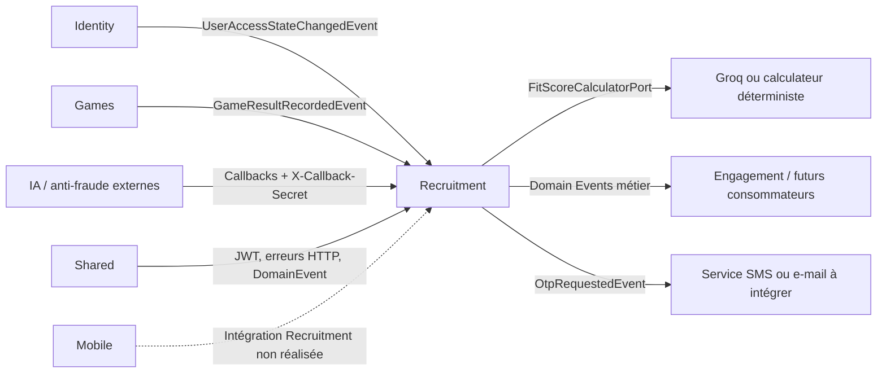

# Module Recruitment

**Dernière mise à jour :** 2026-08-05

## 1. Rôle du module

Le bounded context `recruitment` couvre le parcours de recrutement après la création
du compte dans Identity : publication d'offres, découverte par swipe, création des
matchs mutuels, tests de compétences techniques (hard skills), calcul du Fit Score,
offres d'opportunité, vérifications d'identité et paiement d'une visioconférence.

Le contrat public de référence est `contracts/recruitment.openapi.yaml`. Il décrit
exactement les **55 opérations** réellement exposées sous `/api/v1`.

Le module ne gère pas :

- les comptes, mots de passe, JWT ou profils personnels, qui appartiennent à Identity ;
- la livraison SMS/e-mail des OTP, qui reste à brancher ;
- les conversations et appels vidéo, qui relèvent d'Engagement ;
- les écrans mobiles Recruitment, encore absents du dépôt (maquettes non fournies) ;
- le paiement bancaire réel, car le PSP reste à intégrer.

> **Refonte « squad web » (V22 → V43).** Le tunnel de candidature (`Application`) a été
> supprimé au profit du swipe mutuel → `Match`. L'évaluation anti-fraude
> (`AssessmentAttempt` + `IntegrityStatus`) a été remplacée par le test de hard skills
> (`TestAttempt` / `TestResult`). Le référentiel Fit Score v3 (métiers, profils, matrice
> de pondération) a été introduit. Voir §9 pour le détail des migrations.

## 2. Architecture technique

| Couche | Emplacement | Responsabilité |
|---|---|---|
| API | `recruitment/api/` | Contrôleurs REST, DTO et annotations de sécurité locales |
| Application | `recruitment/application/` | Cas d'usage, contrôles de propriété, OTP et listeners d'événements |
| Domaine | `recruitment/domain/` | Agrégats, règles métier, événements, value objects et ports |
| Infrastructure | `recruitment/infrastructure/` | JPA, PostgreSQL, IA (Groq/déterministe), callbacks, seed dev |
| Contrat | `contracts/recruitment.openapi.yaml` | Source de vérité de l'API publique |

Le domaine reste en Java pur. Les dépendances vont de l'extérieur vers le domaine.
Recruitment ne doit jamais appeler directement les services ou repositories internes
d'un autre bounded context.

## 3. Relations avec les autres modules



### 3.1 Identity → Recruitment

Identity publie `identity.user.access-state-changed.v1` après inscription,
authentification, changement de nom/avatar, changement de rôle, désactivation et
suppression. Recruitment maintient la projection locale `recruitment.actors` : elle
vérifie qu'un JWT encore valide appartient toujours à un utilisateur actif et possède
le rôle attendu, et porte désormais aussi `company_name`/`company_info` du recruteur
(joints à la volée sur les offres, voir V31/V32). Un snapshot Identity au démarrage
initialise les comptes existants ; les événements rejoués ou plus anciens sont ignorés.

### 3.2 Shared → Recruitment

Shared fournit le filtre JWT, la conversion des rôles, les erreurs HTTP communes et
l'interface `DomainEvent`. Il ne contient aucune règle métier Recruitment.

### 3.3 Recruitment → Engagement et livraison OTP

Recruitment publie ses événements métier sans appeler directement Engagement. Les
événements d'opportunité et de paiement pourront débloquer une carte de conversation
ou un appel vidéo chez un consommateur externe.

`recruitment.otp.requested.v1` contient temporairement le code et le `recipientUserId`,
destinés à un futur listener SMS/e-mail. Aucun consommateur de livraison n'est présent :
la génération et la vérification fonctionnent côté backend, mais l'utilisateur ne reçoit
pas encore automatiquement le code.

### 3.4 Games → Recruitment et moteur de Fit Score

`GameResultRecordedEvent` alimente la projection `recruitment.soft_skills_projection`,
désormais **une ligne par module joué** (`candidate_id + module`, voir V22). Recruitment
recalcule ensuite, par lots bornés, les couples candidat/offre active. Le calcul passe
par `FitScoreCalculatorPort` : Groq est utilisé si `GROQ_API_KEY` est configurée, sinon
`DeterministicFitScoreCalculator` permet le fonctionnement offline.

La pondération vient du référentiel `recruitment.job_role_profiles` (24 lignes = 6
profils × 4 niveaux, voir V42) : poids soft/hard, poids par module cognitif et courbe
hard par niveau. Le Fit Score porte maintenant les sous-scores `soft_skill_score`,
`cv_match_score`, `hard_skill_score` et un `coverage_ratio` (défaut 100 tant que Games
n'expose pas la couverture par module, voir V43).

L'entrée CV vient de la projection `recruitment.cv_profile_projection` (V21). Elle reste
alimentée par événement, sans appel direct vers Identity.

### 3.5 Fournisseurs externes → Recruitment

Les services IA et anti-fraude publient leurs résultats sur les callbacks. Ils
n'utilisent pas de JWT utilisateur mais doivent fournir `X-Callback-Secret`.

## 4. Authentification et autorisation

La surface contractuelle de **55 opérations** se répartit ainsi :

- des opérations privées avec JWT (recruteur, candidat/étudiant, admin, ou authentifié
  avec contrôle de propriété) ;
- 2 opérations publiques (`GET /job-offers`, `GET /job-offers/{id}`) ;
- 1 opération publique prévue (`GET /tests/{token}`, encore bloquée, voir §5) ;
- 2 callbacks protégés par secret partagé.

Annotations locales :

- `RecruiterOnly` : JWT recruteur et acteur toujours actif ;
- `CandidateOrStudentOnly` : JWT candidat ou étudiant et acteur actif ;
- `Authenticated` : JWT valide, acteur actif, puis contrôle de propriété dans le cas d'usage ;
- `AdminOnly` : JWT administrateur (modération des métiers proposés) ;
- `@PreAuthorize` conditionnel pour les swipes candidat ou recruteur.

L'identité agissante vient toujours du `sub` du JWT. Les requêtes ne peuvent pas choisir
leur `recruiterId`, `candidateId` ou `swiperId`.

## 5. Inventaire complet des endpoints

Légende : `JWT R` = recruteur, `JWT C/S` = candidat ou étudiant, `JWT A` = admin,
`JWT Auth` = tout acteur authentifié avec contrôle de propriété, `Secret` =
`X-Callback-Secret`.

### 5.1 Métiers et référentiel de profils — 6 opérations

| Méthode | Route | Accès | Comportement |
|---|---|---|---|
| GET | `/job-positions` | JWT Auth | Liste des métiers approuvés (autocomplete de création d'offre) |
| POST | `/job-positions` | JWT R | Propose un nouveau métier en `PENDING_APPROVAL` |
| GET | `/job-positions/pending` | JWT A | Liste des métiers en attente de modération |
| PATCH | `/job-positions/{id}/approve` | JWT A | Approuve un métier proposé |
| PATCH | `/job-positions/{id}/reject` | JWT A | Rejette un métier proposé |
| GET | `/job-role-profiles` | JWT Auth | Lecture du référentiel de pondération Fit Score (24 lignes) |

### 5.2 Offres d'emploi — 9 opérations

| Méthode | Route | Accès | Comportement et propriété |
|---|---|---|---|
| GET | `/job-offers` | Public | Recherche paginée des offres `ACTIVE` ; avec JWT candidat sans filtre, tri par Fit Score décroissant |
| POST | `/job-offers` | JWT R | Crée une offre pour le recruteur du JWT |
| GET | `/job-offers/{id}` | Public | Détail retourné uniquement si l'offre est `ACTIVE` |
| PUT | `/job-offers/{id}` | JWT R | Remplace intégralement une offre possédée |
| PATCH | `/job-offers/{id}` | JWT R | Modifie partiellement une offre possédée |
| PATCH | `/job-offers/{id}/status` | JWT R | Applique une transition de statut valide sur une offre possédée |
| DELETE | `/job-offers/{id}` | JWT R | Supprime une offre du recruteur propriétaire |
| GET | `/recruiters/me/job-offers` | JWT R | Liste uniquement les offres du recruteur connecté |
| GET | `/recruiters/me/candidate-feed` | JWT R | Candidats projetés d'une offre possédée, triés par score, hors paires masquées |

`companyName`/`companyInfo` ne sont plus stockés sur l'offre : ils sont joints à la
volée depuis `recruitment.actors` (V31/V32).

### 5.3 Swipes et decks de matching — 6 opérations

| Méthode | Route | Accès | Comportement et propriété |
|---|---|---|---|
| GET | `/job-offers/matching-deck` | JWT C/S | Deck d'offres actives à swiper pour le candidat |
| POST | `/job-offers/{jobId}/swipes` | JWT C/S | Le candidat swipe l'offre (`RIGHT`/`LEFT`) |
| DELETE | `/job-offers/{jobId}/swipes/me` | JWT C/S | Annule le swipe candidat courant et nettoie le match |
| GET | `/job-offers/{jobId}/candidates/matching-deck` | JWT R | Deck de candidats à swiper pour une offre possédée |
| POST | `/job-offers/{jobId}/candidates/{candidateId}/swipes` | JWT R | Le recruteur swipe un candidat pour son offre |
| DELETE | `/job-offers/{jobId}/candidates/{candidateId}/swipes/me` | JWT R | Annule le swipe recruteur courant et nettoie le match |

Le swipe est un **état courant par `(jobOfferId, candidateId, side)`** (contrainte
d'unicité en base), et non un journal d'actions. Un `Match` est créé uniquement après
deux `RIGHT` opposés sur la même paire `(jobOfferId, candidateId)`.

### 5.4 Matchs — 2 opérations

| Méthode | Route | Accès | Comportement et propriété |
|---|---|---|---|
| GET | `/candidates/me/matches` | JWT C/S | Liste les matchs du candidat connecté |
| GET | `/job-offers/{jobId}/matches` | JWT R | Liste les matchs d'une offre possédée |

Le `Match` est binaire : il existe ou n'existe pas, sans statut intermédiaire (V36). Le
titre de l'offre est lu à la volée, jamais dupliqué sur le match (V28).

### 5.5 Fit Scores — 3 opérations

| Méthode | Route | Accès | Comportement et propriété |
|---|---|---|---|
| GET | `/fit-scores` | JWT Auth | Le candidat lit son score ; le recruteur doit posséder l'offre concernée |
| POST | `/fit-scores/recompute` | JWT R | Déclenche un recalcul borné pour le recruteur |
| DELETE | `/fit-scores?candidateId=&jobOfferId=` | JWT R | Masque idempotemment la paire pour le recruteur propriétaire |

### 5.6 Évaluations (banque de questions recruteur) — 8 opérations

| Méthode | Route | Accès | Comportement et propriété |
|---|---|---|---|
| POST | `/assessments` | JWT R | Crée une évaluation et ses questions |
| POST | `/assessments/generate/from-prompt` | JWT R | Génère une évaluation depuis un prompt (IA Groq/stub) |
| POST | `/assessments/generate/from-file` | JWT R | Génère une évaluation depuis un fichier (`multipart/form-data`, extraction PDF) |
| GET | `/assessments` | JWT R | Liste les évaluations du recruteur connecté |
| GET | `/assessments/mine` | JWT R | Alias historique de la liste personnelle |
| GET | `/assessments/{id}` | JWT R | Retourne une évaluation possédée |
| PUT | `/assessments/{id}` | JWT R | Modifie une évaluation possédée |
| DELETE | `/assessments/{id}` | JWT R | Supprime une évaluation possédée |

### 5.7 Projection publique du test — 1 opération

| Méthode | Route | Accès | Comportement |
|---|---|---|---|
| GET | `/tests/{token}` | Public prévu | Projection candidat sans réponse correcte ; **encore bloquée** par le filtre global (`401`) tant que la permit-list Shared n'est pas autorisée |

### 5.8 Tentatives de test (hard skills) — 3 opérations

| Méthode | Route | Accès | Comportement et propriété |
|---|---|---|---|
| POST | `/job-offers/{jobId}/test-attempts` | JWT C/S | Démarre une tentative : mélange questions/options, `expires_at`, snapshot présenté |
| POST | `/test-attempts/{attemptId}/submit` | JWT C/S | Soumet les réponses ; le score est calculé côté serveur |
| POST | `/test-attempts/{attemptId}/abandon` | JWT C/S | Abandon explicite de la tentative |

Une **seule tentative consommée par `(jobOfferId, candidateId)` pour toujours**, imposée
au niveau base (V37). Le seuil de réussite est un **global fixe (70 %,
`TestResult.PASS_THRESHOLD`)** — le réglage par offre a été supprimé.

### 5.9 Résultats de test — 4 opérations

| Méthode | Route | Accès | Comportement et propriété |
|---|---|---|---|
| GET | `/job-offers/{jobId}/test-results/me` | JWT C/S | Le candidat lit son propre résultat sur l'offre |
| GET | `/job-offers/{jobId}/test-results` | JWT R | Liste des résultats d'une offre possédée |
| GET | `/job-offers/{jobId}/test-results/summary` | JWT R | Synthèse agrégée (scores, réussite, alertes hard skills) |
| GET | `/job-offers/{jobId}/test-results/{candidateId}` | JWT R | Détail du résultat d'un candidat pour une offre possédée |

### 5.10 CV candidat — 1 opération

| Méthode | Route | Accès | Comportement |
|---|---|---|---|
| GET | `/candidates/{candidateId}/resume` | JWT R | Résumé CV/soft-skills projeté du candidat (généré IA, bilingue) |

### 5.11 Offres d'opportunité — 5 opérations

| Méthode | Route | Accès | Comportement et propriété |
|---|---|---|---|
| POST | `/job-opportunity-offers` | JWT R | Envoie une opportunité depuis une offre possédée (précondition : `Match` actif) |
| GET | `/job-opportunity-offers/{offerId}` | JWT Auth | Lecture réservée au recruteur émetteur ou au candidat destinataire |
| POST | `/job-opportunity-offers/{offerId}/confirm` | JWT C/S | Le candidat destinataire demande la confirmation et l'OTP |
| POST | `/job-opportunity-offers/{offerId}/verify-otp` | JWT C/S | Vérifie l'OTP à usage unique et confirme l'opportunité |
| POST | `/job-opportunity-offers/{offerId}/reject` | JWT C/S | Rejette l'opportunité |

### 5.12 Vérification d'identité — 2 opérations

| Méthode | Route | Accès | Comportement et propriété |
|---|---|---|---|
| POST | `/identity-verifications` | JWT R | Demande une vérification pour une offre possédée |
| GET | `/identity-verifications/{verificationId}` | JWT Auth | Lecture par le recruteur demandeur ou le candidat concerné |

### 5.13 Paiement de visioconférence — 3 opérations

| Méthode | Route | Accès | Comportement et propriété |
|---|---|---|---|
| POST | `/payments` | JWT R | Initie un paiement pour un match possédé et génère un OTP |
| GET | `/payments/{paymentId}` | JWT R | Retourne uniquement un paiement du recruteur connecté |
| POST | `/payments/{paymentId}/verify-otp` | JWT R | Vérifie l'OTP et confirme le paiement possédé |

Le paiement conserve seulement `last4` et le type de carte. Aucun numéro complet n'est
persisté et aucun PSP réel n'est encore appelé.

### 5.14 Callbacks externes — 2 opérations

| Méthode | Route | Accès | Comportement |
|---|---|---|---|
| POST | `/callbacks/identity-verification` | Secret | Résultat d'une vérification d'identité |
| POST | `/callbacks/fit-score` | Secret | Score de compatibilité calculé par un fournisseur externe |

Un callback répété avec le même résultat est idempotent (`200`) ; un résultat
contradictoire retourne `409` ; un secret absent, incorrect ou non configuré retourne
`401`. Le callback anti-fraude `/callbacks/integrity` a été supprimé avec le passage à
`TestResult` (V37).

## 6. Parcours métier principaux

### 6.1 Parcours de match (swipe mutuel)

1. Le candidat swipe une offre active à `RIGHT` (`side=CANDIDATE`).
2. Le recruteur swipe le candidat à `RIGHT` pour cette même offre (`side=RECRUITER`).
3. Recruitment crée un `Match` unique et publie `recruitment.match.created`.

L'ancien tunnel de candidature (`Application`) n'existe plus (V34). Le swipe mutuel est
désormais l'unique voie vers un match.

### 6.2 Parcours de test de compétences (hard skills)

1. Le recruteur crée/assigne une évaluation à son offre.
2. Le candidat démarre une tentative : les questions et options sont mélangées et un
   snapshot présenté est figé avec une expiration (`expires_at`).
3. Le candidat soumet les indices de réponses, jamais un score calculé ; Recruitment
   calcule le score, le pourcentage et `passed` (seuil global 70 %) puis persiste un
   `TestResult` unique par `(jobOfferId, candidateId)`.
4. Timeout et abandon produisent un `TestResult` de statut `TIMEOUT`/`ABANDONED`.
5. `recruitment.test_result.completed` est publié.

### 6.3 Parcours OTP

1. Une confirmation d'opportunité ou un paiement déclenche la génération d'un code.
2. Seul le hash SHA-256 salé est persisté dans `recruitment.otp_challenges`.
3. `OtpRequestedEvent` (`recruitment.otp.requested.v1`) est publié pour la livraison future.
4. L'utilisateur renvoie le code sur l'endpoint `/verify-otp` correspondant.
5. Le backend vérifie destinataire, hash, expiration, essais restants et usage unique.

### 6.4 Fit Score et tunnels séparés

1. Un résultat Games met à jour la projection soft-skills par module du candidat.
2. Une publication d'offre ou cette mise à jour déclenche un recalcul borné.
3. Le calculateur produit `score`, `soft_skill_score`, `cv_match_score`,
   `hard_skill_score` et `coverage_ratio` ; le résultat est upserté par paire.
4. Les decks candidat/recruteur trient par score décroissant. Un recruteur peut masquer
   une paire (`fit_score_dismissals`) sans supprimer le score global.

Décision produit D5 : les deux tunnels restent volontairement séparés.

- Tunnel A : sourcing/Fit Score → `JobOpportunityOffer.send()` (proposition de poste et
  salaire), conditionné à un `Match` actif.
- Tunnel B : offre avec test de hard skills → tentative consentie → `TestResult`.

## 7. Machines à états protégées

### Offre (`JobOfferStatus`)

```text
DRAFT ⇄ ACTIVE ⇄ CLOSED
```

Le statut `HIDDEN` a été supprimé (V30) : trois états seulement, librement réversibles.

### Match

Binaire : existe ou n'existe pas (plus de colonne `status`, V36).

### Tentative de test (`TestAttemptStatus`)

```text
IN_PROGRESS → SUBMITTED
IN_PROGRESS → EXPIRED
```

### Résultat de test (`TestResultStatus`)

```text
COMPLETED | TIMEOUT | ABANDONED
```

### Opportunité (`JobOpportunityStatus`)

```text
PENDING → CONFIRMED
PENDING → REJECTED
```

### Paiement (`PaymentStatus`)

```text
PENDING → OTP_SENT → CONFIRMED
                └───→ FAILED
```

### Métier proposé (`JobPositionStatus`)

```text
PENDING_APPROVAL → APPROVED
                 └→ REJECTED
```

## 8. Événements de domaine

| Événement | Rôle |
|---|---|
| `recruitment.joboffer.created` | Signale la création d'une offre |
| `recruitment.joboffer.status_changed` | Signale une transition de statut d'offre |
| `recruitment.swipe.recorded` | Signale un swipe enregistré |
| `recruitment.match.created` | Signale un match mutuel |
| `recruitment.test_result.completed` | Signale un résultat de test finalisé |
| `recruitment.opportunity_offer.sent` | Signale une opportunité envoyée |
| `recruitment.opportunity_offer.confirmed` | Signale sa confirmation |
| `recruitment.identity_verification.requested` | Demande un traitement anti-fraude |
| `recruitment.payment.confirmed` | Autorise le futur déblocage de la visioconférence |
| `recruitment.otp.requested.v1` | Demande la livraison éphémère d'un OTP |

Événements retirés à la refonte : `recruitment.application.submitted`,
`recruitment.application.status_changed`, `recruitment.assessment_attempt.submitted`.

La présence d'un événement ne signifie pas qu'un consommateur Engagement, SMS ou
Analytics est déjà branché.

## 9. Base de données et migrations

Le module utilise le schéma PostgreSQL `recruitment`. Hibernate fonctionne avec
`ddl-auto: validate` : toute évolution passe par une nouvelle migration Flyway ; aucune
migration déjà appliquée n'est réécrite.

### 9.1 Tables actuelles (schéma `recruitment`)

| Table | Rôle |
|---|---|
| `job_offers` | Offres ; `job_position_id`, `experience_level`, `status`, `updated_at` server-owned |
| `job_positions` | Référentiel de métiers modérés (labels par niveau, secteur, `profile_type`) |
| `job_role_profiles` | Matrice de pondération Fit Score v3 (6 profils × 4 niveaux) |
| `swipes` | État courant `(job_offer_id, candidate_id, side)` ; `direction` `RIGHT`/`LEFT` |
| `matches` | Match binaire `(candidate_id, job_offer_id, recruiter_id)` |
| `fit_scores` | Score + sous-scores `soft/cv/hard` + `coverage_ratio` ; upsert par paire |
| `fit_score_dismissals` | Masquage d'une paire par recruteur |
| `soft_skills_projection` | Score soft par `(candidate_id, module)` |
| `cv_profile_projection` | Texte CV projeté par candidat |
| `soft_skills_summary` | Résumé soft-skills IA bilingue (`text_fr`/`text_en`) |
| `hard_skills_summary` | Résumé hard-skills IA bilingue par `(candidate_id, job_offer_id)` |
| `assessments` | Banque d'évaluations recruteur (`questions_json`, `updated_at`) |
| `test_attempts` | Tentative de test hard skills (snapshot présenté, expiration, statut) |
| `test_results` | Résultat unique par `(candidate_id, job_offer_id)` |
| `actors` | Projection Identity (rôle, actif, `company_name`/`company_info`) |
| `otp_challenges` | OTP hashés (salt + SHA-256, expiration, essais restants) |
| `job_opportunity_offers` | Offres d'opportunité recruteur → candidat (flux OTP) |
| `identity_verifications` | Demandes de vérification d'identité |
| `video_conference_payments` | Paiement visioconférence (last4, flux OTP) |

### 9.2 Historique des migrations

| Migration | Contenu | Règle |
|---|---|---|
| `V2` | Première table de candidatures (`applications`) | Historique immuable (table supprimée en V34) |
| `V13` | Schéma complet initial (offres, swipes, matchs, scores, évaluations, opportunités, paiements) | Zone protégée, ne jamais modifier |
| `V14` | Projection des rôles/états Identity (`actors`) | Appliquée |
| `V15` | OTP hashés (`otp_challenges`) | Appliquée |
| `V16` | Lien attempt/application + seuil par offre (`passing_score`) | Appliquée (`passing_score` supprimé en V37) |
| `V17` | Sous-scores Fit Score + projection soft-skills mono-ligne | Appliquée |
| `V18` | Masquage des paires par recruteur (`fit_score_dismissals`) | Appliquée |
| `V19` | Consentement de monitoring sur les tentatives | Appliquée |
| `V20` | Infos d'affichage de l'acteur | Appliquée |
| `V21` | Projection CV candidat (`cv_profile_projection`) | Appliquée |
| `V22` | Projection soft-skills **par module** (`candidate_id + module`) | Appliquée |
| `V23` | Résumés IA soft/hard skills bilingues | Appliquée |
| `V24` | Bandes `ExperienceLevel` remaniées (Junior/Senior/Lead/Manager, D8) | Appliquée |
| `V25` | Table `job_positions` + extension `pgcrypto` | Appliquée |
| `V26` | Seed des métiers | Appliquée |
| `V27` | `job_position_id` sur `job_offers` (FK) | Appliquée |
| `V28` | Suppression de `matches.job_offer_title` (lu à la volée) | Appliquée |
| `V29` | Renommage des 4 bandes → `JUNIOR/MID/SENIOR/EXECUTIVE` | Appliquée |
| `V30` | Suppression du statut `HIDDEN` (offres) | Appliquée |
| `V31` | `company_name`/`company_info` sur `actors` | Appliquée |
| `V32` | Nettoyage `job_offers` (drop company/field/currency/remote) + `updated_at` server-owned | Appliquée |
| `V33` | `updated_at` server-owned sur `assessments` | Appliquée |
| `V34` | Suppression de l'entité/table `applications` (tunnel remplacé par le swipe) | Appliquée |
| `V35` | Refonte du modèle `swipes` (état par `(offer, candidate, side)`, `RIGHT`/`LEFT`) | Appliquée |
| `V36` | Suppression de `matches.status` (match binaire) | Appliquée |
| `V37` | `assessment_attempts` → `test_attempts`/`test_results` ; seuil global 70 % | Appliquée |
| `V42` | Référentiel de pondération Fit Score v3 (`job_role_profiles`, 24 lignes) | Appliquée |
| `V43` | `hard_skill_score` + `coverage_ratio` sur `fit_scores` | Appliquée |

(V38–V41 appartiennent au module Engagement, hors périmètre Recruitment.)

## 10. Configuration

```env
RECRUITMENT_CALLBACK_SECRET=<secret-aléatoire-partagé>
RECRUITMENT_OTP_TTL=PT10M
RECRUITMENT_OTP_MAX_ATTEMPTS=5
GROQ_API_KEY=<optionnel>
```

| Variable | Fonction |
|---|---|
| `RECRUITMENT_CALLBACK_SECRET` | Secret partagé avec les fournisseurs de callback ; vide = callbacks refusés |
| `RECRUITMENT_OTP_TTL` | Durée ISO-8601 de validité du code, dix minutes par défaut |
| `RECRUITMENT_OTP_MAX_ATTEMPTS` | Nombre maximal de codes incorrects, cinq par défaut |
| `GROQ_API_KEY` | Active le calcul Groq (Fit Score, génération d'évaluation, résumés) ; vide = mode déterministe/stub offline |

## 11. Value objects et énumérations

| Enum | Valeurs |
|---|---|
| `JobOfferStatus` | `DRAFT`, `ACTIVE`, `CLOSED` |
| `SwipeDirection` | `RIGHT`, `LEFT` |
| `SwipeSide` | `CANDIDATE`, `RECRUITER` |
| `ExperienceLevel` | `JUNIOR`, `SENIOR`, `LEAD`, `MANAGER` (F31/D-A, retour à l'échelle CdC, V53) |
| `ContractType` | `FULL_TIME`, `PART_TIME`, `CONTRACT`, `TEMPORARY`, `APPRENTICESHIP`, `VOLUNTEER` |
| `WorkplaceType` | `ON_SITE`, `REMOTE`, `HYBRID` |
| `JobProfileType` | `TECHNIQUE`, `ANALYTIQUE`, `RELATIONNEL`, `MANAGERIAL`, `CONVENTIONNEL`, `ARTISTIQUE` (inspiré RIASEC) |
| `TypeEvaluationHard` | `QCM`, `PORTFOLIO`, `MIXTE` |
| `JobPositionStatus` | `PENDING_APPROVAL`, `APPROVED`, `REJECTED` |
| `TestAttemptStatus` | `IN_PROGRESS`, `SUBMITTED`, `EXPIRED` |
| `TestResultStatus` | `COMPLETED`, `TIMEOUT`, `ABANDONED` |
| `HardSkillsAlertLevel` | `NONE`, `INFO`, `MODERATE`, `STRONG`, `PORTFOLIO_BASED` (F19, ARTISTIQUE) |
| `JobOpportunityStatus` | `PENDING`, `CONFIRMED`, `REJECTED` |
| `PaymentStatus` | `PENDING`, `OTP_SENT`, `CONFIRMED`, `FAILED` |
| `IdentityVerificationStatus` | `PENDING`, `COMPLETED_SUCCESS`, `COMPLETED_FAILURE` |
| `OtpPurpose` | `PAYMENT`, `JOB_OPPORTUNITY` |
| `AssessmentGenerationMode` | `FROM_PROMPT`, `FROM_FILE` (+ variantes internes) |

## 12. Erreurs HTTP principales

| Code | Signification |
|---|---|
| `400` | Corps, paramètre, transition ou fichier invalide |
| `401` | JWT absent/invalide ou secret callback incorrect |
| `403` | Mauvais rôle, compte inactif ou ressource appartenant à un autre acteur |
| `404` | Ressource absente ou volontairement masquée |
| `409` | Doublon (swipe/tentative unique) ou résultat callback contradictoire |
| `429` | Limite externe atteinte lorsqu'elle s'applique |
| `502` | Fournisseur Groq indisponible ou réponse invalide |
| `503` | Fournisseur externe indispensable indisponible |

## 13. Tests et garde-fous

- Parité automatique entre les routes runtime et le contrat OpenAPI.
- Vérification que chaque endpoint est protégé ou explicitement public.
- Tests des rôles, propriétés, swipes, états métier, OTP, callbacks et projection Identity.
- Tests dédiés : unicité du swipe par `(offer, candidate, side)`, création du match sur
  double `RIGHT`, unicité de la tentative/résultat par `(offer, candidate)`, seuil global
  70 %, upsert/sous-scores Fit Score, parsing Groq, tri/dismissal, projection publique
  sans réponse, matrice `job_role_profiles`.
- ArchUnit vérifie les frontières de couches et de modules.
- Flyway valide toutes les migrations jusqu'à V43 sur PostgreSQL 16 avec `ddl-auto: validate`.

## 14. Zones protégées

- Calcul des scores (Fit Score, test hard skills) côté serveur uniquement.
- Match créé uniquement après deux `RIGHT` opposés sur la même paire.
- Tentative/résultat de test **unique et définitif** par `(jobOfferId, candidateId)`.
- Seuil de réussite global fixe (70 %) — plus de réglage par offre.
- Transitions des offres, opportunités, paiements et métiers proposés.
- Propriété des ressources déduite du JWT.
- Secret des callbacks et stockage hashé des OTP.
- Matrice `job_role_profiles` (contraintes de somme 100/100).
- Migrations Flyway existantes, en particulier V13.
- Absence d'appel direct vers les couches internes d'Identity ou Engagement.

## 15. Décisions à valider et roadmap

1. Choisir le canal et le fournisseur de livraison de `OtpRequestedEvent`, et le module
   qui résout `recipientUserId` → téléphone/e-mail sans appel direct inter-contexte.
2. Autoriser l'ajout ciblé de `/api/v1/tests/**` dans `shared/SecurityConfig` (projection
   publique du test encore bloquée en `401`).
3. Intégrer le PSP et remplacer le paiement simulé.
4. Fournir/localiser les maquettes Recruitment puis connecter le mobile aux endpoints.
5. Ajouter les consommateurs Engagement des événements d'opportunité et de paiement.
6. **Calibrer la matrice `job_role_profiles`** (`calibrated=false` partout — v1 à valider
   en atelier RH avant mise en production).
7. Brancher la **couverture par module** côté Games pour alimenter `coverage_ratio`
   (aujourd'hui figé à 100).
8. **F06/F30 — sélecteur de métier mobile encore absent** (FITSCORE_REMEDIATION.md §3).
   `CreateJobOfferParams.jobPositionId` est câblé côté requête (F06) mais aucun écran ne
   permet de le renseigner : ni repository, ni entité, ni page pour `GET /job-positions`
   côté mobile. Décision explicite (2026-08-05) : câbler le champ sans construire l'écran
   dans cette itération plutôt que d'improviser un picker non maquetté — la création
   d'offre reste donc cassée de bout en bout depuis l'app tant que l'écran n'existe pas.
   F30 (préremplissage des curseurs de pondération depuis `GET /job-role-profiles`) est
   bloqué par le même trou : la pondération dépend du `profileType` du métier choisi.
9. **F32 — mode d'évaluation par métier reporté** (décision D-C, FITSCORE_REMEDIATION.md
   §3). Déplacer `type_evaluation_hard` de `job_role_profiles` vers `job_positions` change
   la signature du record `JobRoleProfile`, qui est aussi construit par deux fichiers de
   test possédés par Track A (`FitScoreBaselineTest`, `DeterministicFitScoreCalculatorTest`).
   Décision explicite (2026-08-05) : reporté plutôt que de modifier des fichiers hors
   périmètre sans coordination — à faire avec Track A une fois leur merge passé.
10. **`fits_repository_impl.dart` appelle des routes disparues du contrat** — `/swipes`,
    `/swipes/targets`, `/recruiters/me/matches` n'existent plus (remplacées par
    `/job-offers/{id}/swipes`, `/job-offers/matching-deck`, `/candidates/me/matches`,
    `/job-offers/{id}/matches` — voir la refonte squad web, entrée de changelog #7).
    Le fichier reste actif (branché sur le swipe deck, la recherche et les matchs) mais
    plusieurs de ses méthodes (`getCandidateDeck`, `getSwipedTargetIds`, `swipe`,
    `undoSwipe`, `getCandidateMatches`, `getRecruiterMatches`) échoueront en pratique.
    Découvert en marge de F10 (2026-08-05), hors périmètre de l'audit Fit Score — signalé,
    non corrigé, nécessite son propre lot de travail.

## 16. Changelog

1. 2026-07-14 — Création de la documentation du module ; contrat aligné sur les 40
   routes runtime ; sécurité par rôle/propriété, projection Identity, callbacks signés
   et OTP persistants ajoutés ; couverture de contrat et de sécurité installée. La revue
   `claude -p` a ensuite verrouillé le détail public aux seules offres actives.
2. 2026-07-14 — Documentation étendue avec l'inventaire complet des 40 endpoints,
   les règles d'accès, les parcours métier, les machines à états, les événements, les
   migrations, la configuration et les relations intermodules actuelles ou planifiées.
3. 2026-07-16 — Intégration du plan Recruitment A–E : candidature liée à
   l'assessment avec consentement et seuil par offre, résultats recruteur enrichis,
   applicant count, moteur de fit score Groq/stub alimenté par Games, sous-scores,
   decks bidirectionnels, dismissal, projection publique des tests et migrations
   V16–V18. Le permit public Shared et les écrans mobiles restent explicitement
   ouverts faute d'autorisation et de maquettes.
4. 2026-07-18 — Événements `ApplicationSubmittedEvent` et
   `ApplicationStatusChangedEvent` enrichis avec recruteur/titre et publiés après persistance
   pour alimenter Engagement ; migration V21 ajoutée pour aligner
   `assessment_attempts.monitoring_consent` et rétablir `ddl-auto=validate`.
5. 2026-07-18 — Correctif revue (Lot A) : `IdentityAccessStateListener` passe en
   `@TransactionalEventListener(AFTER_COMMIT, fallbackExecution=true)` +
   `@Transactional(REQUIRES_NEW)`. La projection d'accès se met à jour dans une transaction
   indépendante et ne rollback plus la transaction Identity émettrice ; le rejeu du snapshot de
   démarrage (hors transaction) est préservé. Garde `lastEventAt`/`lastEventId` inchangée.
6. 2026-07-18 — Stabilisation du listener Identity : le callback `AFTER_COMMIT` capture les
   erreurs du projector `REQUIRES_NEW`. Une projection défaillante ne rollback pas Identity et
   ne remonte plus une réponse HTTP 500 après un commit réussi ; le snapshot réconcilie l'état au
   prochain démarrage.
7. 2026-07-26 — Mise à jour de la documentation pour refléter la refonte « squad web »
   (migrations V22–V43), non couverte depuis la V21. Changements majeurs tracés :
   suppression du tunnel `Application` au profit du swipe mutuel → `Match` (V34) ; refonte
   du modèle `Swipe` en état par `(offer, candidate, side)` avec `RIGHT`/`LEFT` (V35) ;
   `Match` binaire, sans statut ni titre dupliqué (V28, V36) ; remplacement de
   `AssessmentAttempt`/`IntegrityStatus` par `TestAttempt`/`TestResult` avec tentative
   unique définitive et seuil global 70 % (V37) ; suppression du statut `HIDDEN` des offres
   (V30) ; `companyName`/`companyInfo` déplacés sur la projection `actors` (V31/V32) ;
   introduction du référentiel Fit Score v3 (`job_positions`, `job_role_profiles`,
   projection soft-skills par module, sous-scores `hard_skill_score`/`coverage_ratio` —
   V22, V25–V27, V42, V43) ; suppression du callback `/callbacks/integrity`. Inventaire
   d'endpoints porté à 55 opérations, machines à états, événements, énumérations et liste
   des tables réalignés. La projection publique `/tests/{token}`, le PSP réel, les
   consommateurs Engagement, la calibration de la matrice RH et la couverture par module
   restent explicitement ouverts.
8. 2026-08-05 — Track B de la remédiation Fit Score v3 (`FITSCORE_REMEDIATION.md`,
   branche `fix/fitscore-track-b-client`, Phase 0 déjà sur `main`) : 12 constats traités
   sur 15.
   - **F05** — bornes d'alerte hard skills corrigées (`<= 35` reste INFO, plancher MODERATE
     explicite au niveau MANAGER) ; CdC §6 réécrit pour documenter la dérivation plutôt
     qu'une table non monotone irréalisable par seuil unique. Test paramétré sur les 24
     lignes seedées.
   - **F09** — les 6 descriptions du classifieur de métier réécrites depuis le CdC §4.3 et
     la matrice V26 réellement seedée (contredisaient auparavant les profils : « développement
     logiciel » sous ANALYTIQUE, « vente » sous MANAGERIAL). Test de reclassification sur
     10 métiers seedés.
   - **F20** — `JobOfferController.toSummaries()` bat désormais `actors.findByIds` et
     `roleProfileResolver.resolveAll` au lieu d'un aller-retour par offre (3
     requêtes/offre → 2 requêtes pour toute la page).
   - **F23/F24** — `assessmentId` n'est plus envoyé à la création d'offre côté mobile
     (contrat squad web §3.3 : réservé au PATCH ; avec `fail-on-unknown-properties: true`
     l'envoyer faisait 400 toute la requête, pas un « silencieusement ignoré » comme le
     supposait l'audit initial). Branche morte retirée de `CreateJobOfferUseCase`. La page
     de création chaîne désormais `assignAssessment` après la création si un test a été
     choisi dans le formulaire.
   - **F25** — index unique partiel sur `job_positions(name) WHERE sector IS NULL`
     (migration V58) : les 9 métiers transverses n'étaient pas protégés des doublons.
   - **F28** — test d'invariant sur la courbe de pondération des 24 lignes seedées (pic au
     niveau SENIOR, décroissance jusqu'à MANAGER).
   - **F06** — `jobPositionId` câblé dans `CreateJobOfferParams` et le payload de création ;
     aucun écran de sélection construit (voir §15.8, décision explicite).
   - **F18** — phrase de désengagement obligatoire (D-F) ajoutée dans
     `GetCandidateResumeUseCase` pour les métiers ARTISTIQUE évalués uniquement par
     portfolio, à la place du message « un test doit être passé » qui était trompeur pour
     ce profil.
   - **F10** — `CandidateProfile` n'affiche plus trois scores de module fabriqués à partir
     d'un seul agrégat `softSkillsScore` ; `hardSkillScore` réel câblé (était toujours
     vide) ; parsing de `location` corrigé au passage (objet imbriqué, pas des clés plates).
   - **F19** — nouvelle valeur `PORTFOLIO_BASED` sur `HardSkillsAlertLevel` (contrat +
     domaine) pour distinguer le cas Artistique de « pensez à ajouter un QCM ».
   - **F16/F17/F29** — signaux de confiance et Fit Score câblés côté mobile pour la
     première fois (`fitScore`/`hardSkillsAlert` ajoutés à `JobOffer`, `partialData` à
     `CandidateProfile`) : badge Fit Score sur le deck candidat, bandeau d'alerte hard
     skills sur les offres du recruteur (reformulé en réassurance pour PORTFOLIO_BASED),
     mention explicite « soft skills only (standard) » quand aucune évaluation hard skills
     n'existe pour un candidat.
   - **Reporté** — F32 (déplacement de `type_evaluation_hard`, bloqué par des fichiers de
     test Track A) et F30 (bloqué par l'absence du même écran que F06). Voir §15.8–9.
   - **Découvert hors périmètre** — `fits_repository_impl.dart` appelle plusieurs routes
     disparues du contrat (swipe/undo/matches). Voir §15.10.
   - Vérifié : `./mvnw test` vert sur le module recruitment (173 tests) sous JDK 21 — le
     `java` par défaut de cette machine est la 25, que le Mockito de ce projet ne sait pas
     encore instrumenter. Côté mobile, `flutter analyze`/`flutter test` non exécutés
     (Flutter non installé dans cet environnement) ; changements relus à la main contre le
     contrat.
